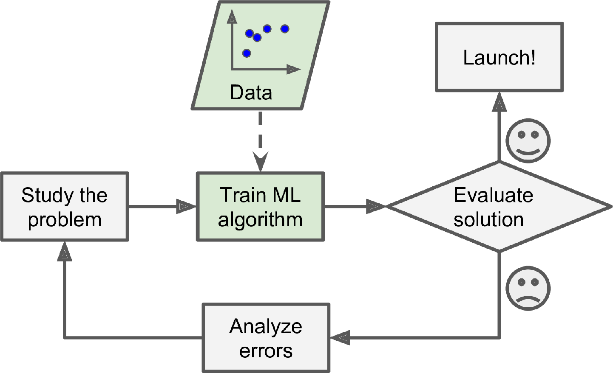
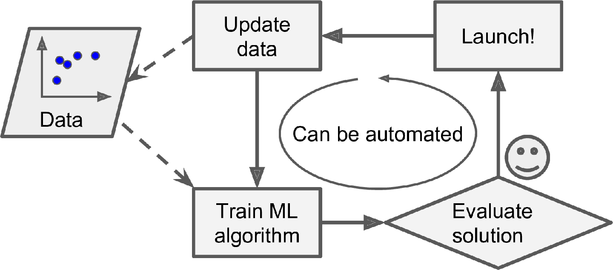
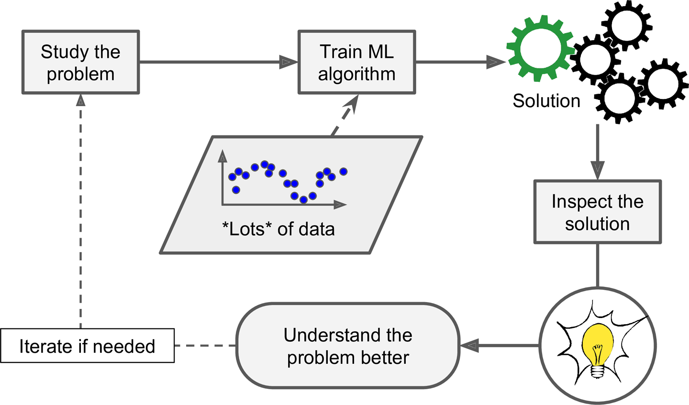
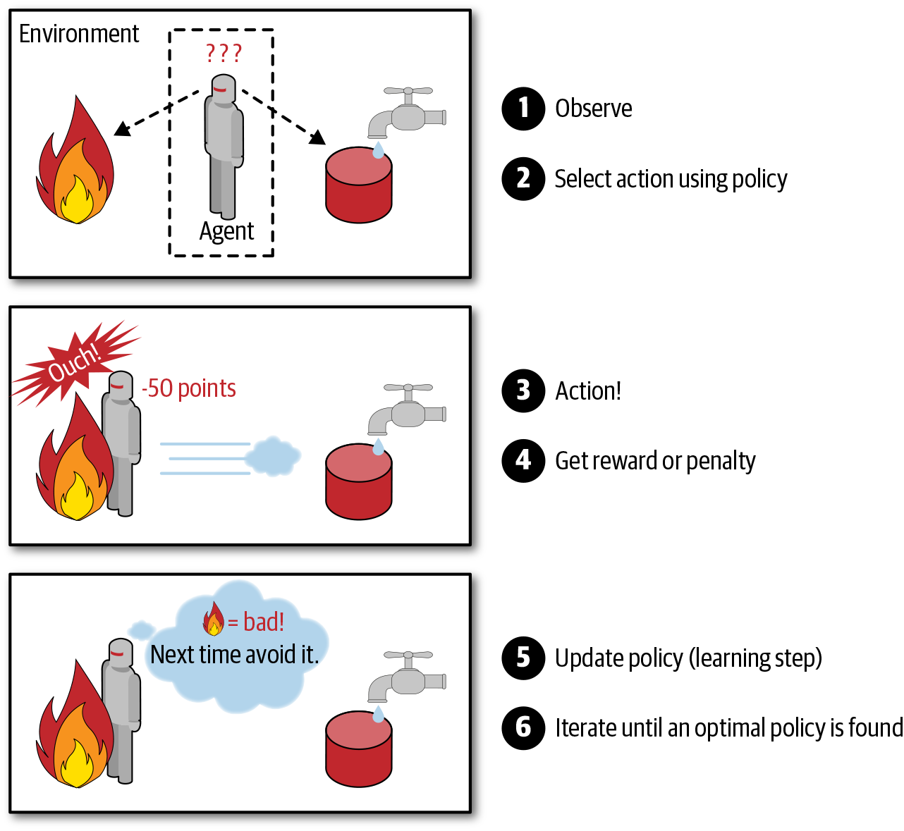
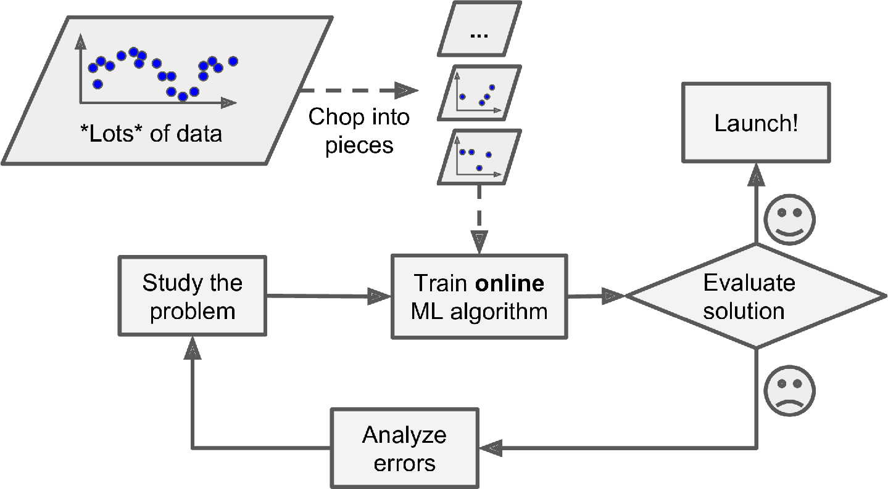
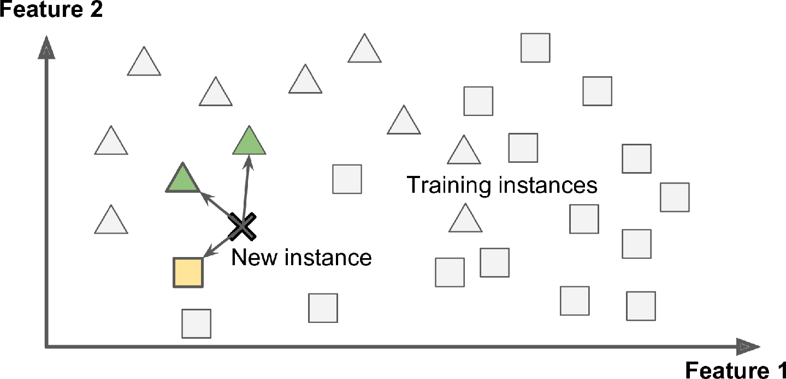
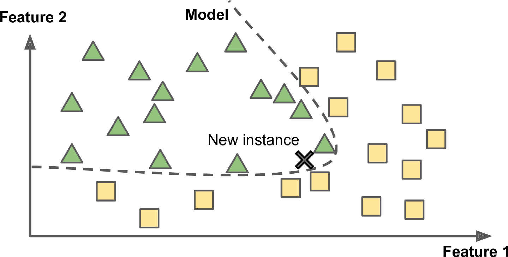

# 1. What is Machine Learning?

ML is the science (and art) of programming computers so they can learn from data.

+   **a slightly more generally definition**:

    ML is the filed of study that gives computers the ability to learn without being explicitly programmed.

+   **a more engineering-oriented** (以...为导向的/目标的) **one**:

    A computer program is said to learn from experience E with respect to some task T and some performance measure P, if its performance on T, as measured by P, improves with experience E.

    

# 2. Why use ML?

+   Problems for which existing solutions require a lot of fine-tuning or long lists of rules: one Machine Learning algorithm can often simplify code and perform better than the traditional approach.

+   Complex problems for which using a traditional approach yields no good solution: the best Machine Learning techniques can perhaps find a solution.

+   Fluctuating environments: a Machine Learning system can adapt to new data.

+   Getting insights about complex problems and large amounts of data.

The traditional approach

The ML approach

Automatically adapting to change

ML can help humans learn

 

# 3. Types of ML systems

-   Whether or not they are trained with human supervision (supervised, unsupervised, semisupervised, and Reinforcement Learning).
-   Whether or not they can learn incrementally on the fly (online versus batch learning)
-   Whether they work by simply comparing new data points to known data points, or instead by detecting patterns in the training data and building a predictive model, much like scientists do (instance-based versus model-based learning)

## 3.1 Supervised/Unsupervised Learning

Machine Learning systems can be classified according to the amount and type of supervision they get during training.

### 3.1.1 Supervised Learning

The training set you feed to the algorithm includes the desired solutions, called *labels*.

Supervised Learning (classification)

- classification
- regression

**Note that some regression algorithms can be used for classification as well, and vice versa** (e.g.,  *Logistic Regression* is commonly used for classification, outputing a value that corresponds to the probability of belonging to a given class.

### 3.1.2 Unsupervised Learning

The training set is unlabeled.
    

Dataset for Unsupervised Learning

-   Clustering: detect groups
    -   K-Means
    -   DBSCAN
    -   Hierarchical Cluster Analysis (HCA): may also subdivide each group into smaller groups
-   Anomaly detection and novelty detection
    -   One-class SVM
    -   Isolation Forest
-   Visualization and dimensionality reduction
    -   Principal Component Analysis (PCA)
    -   Kernel PCA
    -   Locally Linear Embedding (LLE)
    -   t-Distributed Stochastic Neighbor Embedding (t-SNE)
-   Association rule learning
    -   Apriori
    -   Eclat
-   **Notes**
    -   *Visualization algorithms*: output a 2D or 3D representation of your data that can easily be plotted. These algorithms try to preserve as much structure as they can (e.g., trying to keep separate clusters in the input space from overlapping in the visualization) so that you can understand how the data is organized and perhaps identify unsuspected patterns.
    -   *dimensionality reduction*: simplify the data without losing too much information. One way to do this is to merge several correlated features into one, called *feature exraction*.
    -   *anomaly detection*: The system is shown mostly normal instances during training, so it learns to recognize them; then, when it sees a new instance, it can tell whether it looks like a normal one or whether it is likely an anomaly.
    -   *novelty detection*: aims to detect new instances that look different from all instances in the training set. This requires having a very “clean” training set, devoid of (缺乏) any instance that you would like the algorithm to detect.
    -   *association rule learning*: dig into large amounts of data and discover interesting relations between attributes.

### 3.1.3 Semi-supervised Learning

There has plenty of unlabeled instances, and few labeled instances. Some algorithms can deal with data that’s partially labeled. This is called *semisupervised learning*.

Semisupervised learning with two classes (triangles and squares): the unlabeled examples (circles) help classify a new instance (the cross) into the triangle class rather than the square class, even though it is closer to the labeled squares

**Most semisupervised learning algorithms are combinations of unsupervised and supervised algorithms**. For example, *deep belief networks* (DBNs) are based on unsupervised components called *restricted Boltzmann machines* (RBMs) stacked on top of one another. RBMs are trained sequentially in an unsupervised manner, and then the whole system is fine-tuned using supervised learning techniques.
    

### 3.1.4 Reinforcement Learning

The learning system, called an *agent* in this context, can observe the environment, select and perform actions, and get *rewards* in return (or *penalties*). It must then learn by itself what is the best strategy, called a *policy*, to get the most reward over time.

A policy defines what action the agent should choose when it is in a given situation.

Reinforcement Learning

## 3.2 Batch and Online Learning

Another criterion used to classify Machine Learning systems is whether or not the system can learn incrementally from a stream of incoming data.

### 3.2.1 Batch Learning

In *batch learning*, the system is **incapable of learning incrementally**: it must be trained **using all the available data** (generally takes a lot of time and computing resources, and is typically done offline).  After the system is trained, and then it is launched into production and runs without learning anymore; it just applies what it has learned. This is called **offline learning**.

+   If you **want a batch learning system to know about new data** (such as a new type of spam), you **need to train a new version of the system from scratch on the full dataset** (not just the new data, but also the old data), then stop the old system and replace it with the new one.

    This solution is simple and often works fine, but **training using the full set of data can take many hours**, so you would typically train a new system only every 24 hours or even just weekly. If your system needs to adapt to rapidly changing data (e.g., to predict stock prices), then you need a more reactive solution.

+   Also, **training on the full set of data requires a lot of computing resources** (CPU, memory space, disk space, disk I/O, network I/O, etc.). If you have a lot of data and you automate your system to train from scratch every day, it will end up costing you a lot of money. If the amount of data is huge, it may even be impossible to use a batch learning algorithm.

+   Finally, if your system needs to be able to learn autonomously (独立地) and it has limited resources (e.g., a smartphone application or a rover on Mars), then carrying around large amounts of training data and taking up a lot of resources to train for hours every day is a showstopper.

A better option in all these cases is to use algorithms that are capable of learning incrementally.

### 3.2.2 Online Learning

In *online learning*, you train the system **incrementally by feeding it data instances sequentially, either individually or in small groups called *mini-batches***. Each learning step is fast and cheap, so the system can learn about new data on the fly, as it arrives.

In online learning, a model is trained and launched into production, and then it keeps learning as new data comes in

+   Online learning is great for systems that receive data as a continuous flow (e.g., stock prices) and need to adapt to change rapidly or autonomously (独立地). 
+    It is also a good option **if you have limited computing resources**: once an online learning system has learned about new data instances, it does not need them anymore, so you can discard them (unless you want to be able to roll back to a previous state and “replay” the data). This can save a huge amount of space.
+   Online learning algorithms can also be used to **train systems on huge datasets** that cannot fit in one machine’s main memory (this is called **out-of-core learning**). The algorithm loads part of the data, runs a training step on that data, and repeats the process until it has run on all of the data.

>   **Out-of-core learning** is usually done offline (i.e., not on the live system), so online learning can be a confusing name. Think of it as incremental learning.

Using online learning to handle huge datasets

**One important parameter of online learning systems** is how fast they should adapt to changing data: this is called the **learning rate**. If you *set a high learning rate*, then your system will rapidly adapt to new data, but it will also tend to quickly forget the old data (you don’t want a spam filter to flag only the latest kinds of spam it was shown). Conversely, if you *set a low learning rate*, the system will have more inertia (惰性、惯性); that is, it will learn more slowly, but it will also be less sensitive to noise in the new data or to sequences of nonrepresentative data points (outliers).

**A big challenge with online learning is that if bad data is fed to the system, the system’s performance will gradually decline**. To reduce this risk, you

+   need to monitor your system closely and promptly switch learning off (and possibly revert to a previously working state) if you detect a drop in performance. 
+   may also want to monitor the input data and react to abnormal data (e.g., using an anomaly detection algorithm).

## 3.3 Instance-based v.s. Model-based Learning

One more way to categorize Machine Learning systems is by how they *generalize*.

### 3.3.1 Instance-based Learning

The system learns the examples by heart, then generalizes to new cases by using a similarity measure to compare them to the learned examples (or a subset of them).

Instance-based learning

### 3.3.2 Model-based Learning

Another way to generalize from a set of examples is to build a model of these examples and then use that model to make *predictions*. This is called *model-based learning*.

Model-based learning

# 4. Main challenges of ML

Since the main task is to select a learning algorithm and train it on some data, the two things that can go wrong are "bad algorithm" and "bad data".

## 4.1 Bad data

### 4.1.1 Insufficient quantity of training data

It takes a lot of data for most ML algorithms to work properly. Even for very simple problems you typically need thousands of examples, and for complex problems such as image or speech recognition you may need millions of examples (unless you can reuse parts of an existing model).

[Microsoft 2001 paper](https://homl.info/6) showed that very different ML algorithms, including fairly simple ones, performed almost identically well on a complex problem of natural language disambiguation once they were given enough data.

The importance of data v.s. algorithm

These results suggest that we may want to reconsider the trade-off between spending time and money on algorithm development v.s. spending it on corpus development.

[2009 paper](https://homl.info/7) showed that, however, that small- and medium-sized datasets are still very common, and it is not always easy or cheap to get extra training data⁠—so don’t abandon algorithms just yet.

### 4.1.2 Nonrepresentative training data

