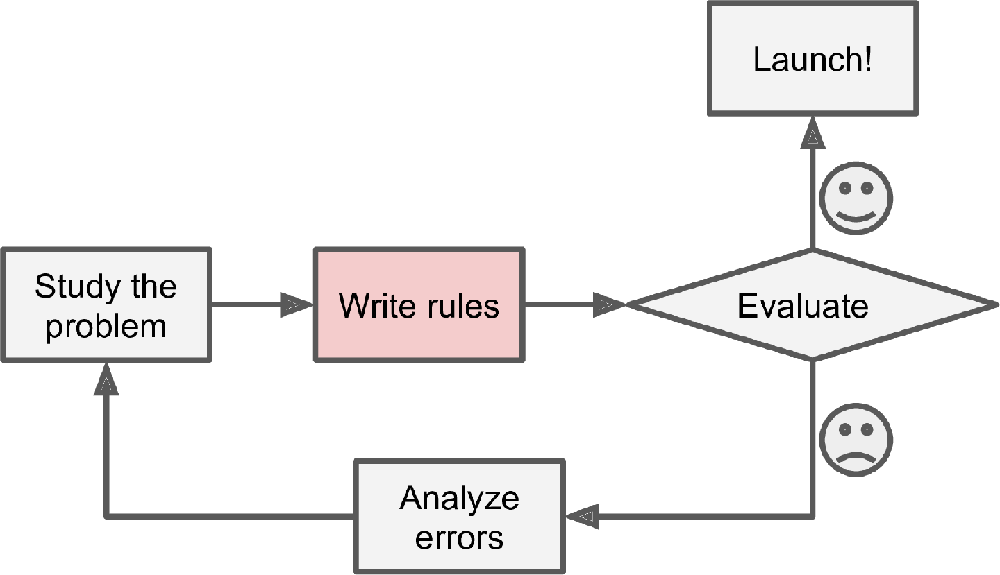
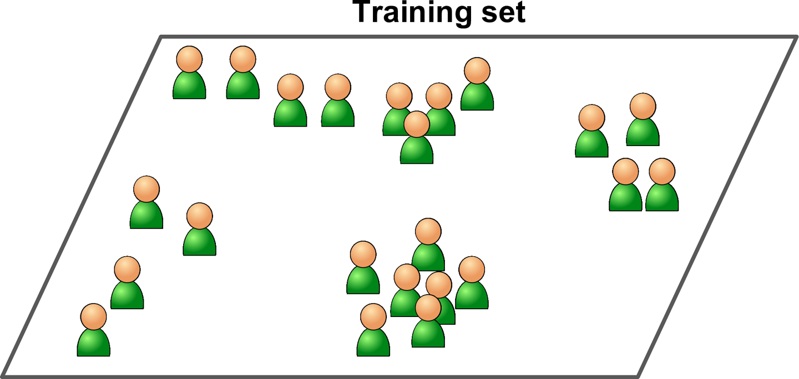
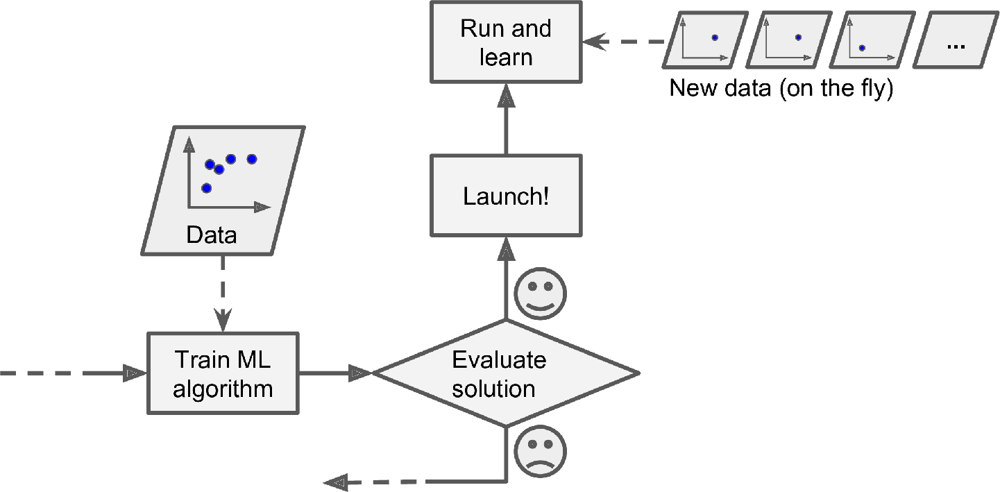

# TOC

1. [机器学习的定义](#1-什么是机器学习)
2. [为什么使用机器学习](#2-为什么使用机器学习)
3. [机器学习的应用实例](#3-ML-应用实例)
4. [机器学习的种类](#4-机器学习系统的种类)
    -   [监督学习和无监督学习](#41-监督学习和无监督学习)
        -   [监督学习](#411-监督学习supervised-learning)
        -   [无监督学习](#412-无监督学习unsupervised-learning)
        -   [半监督学习](#413-半监督学习semi-supervised-learning)
        -   [强化学习](#414-强化学习reinforcement-learning)
    -   [批量学习和在线学习](#42-批量学习batch-learning和在线学习online-learning)
        -   [批量学习](#421-批量学习batch-learning)
        -   [在线学习](#422-在线学习offline-learning)
    -   [基于实例的学习和基于模型的学习](#43-基于实例的学习instance-based-learning和基于模型的学习model-based-learning)
        -   [基于实例的学习](#431-基于实例的学习instanced-based-learning)
        -   [基于模型的学习](#432-基于模型的学习model-based-learning)
5. [机器学习的主要挑战](#5-ml-的主要挑战)
    -   [坏数据（Bad Data）](#51-坏数据bad-data)
        -   [训练数据不足](#511-训练数据不足insufficient-quantity-of-training-data)
        -   [训练数据不具代表性](#512-训练数据不具代表性non-representative-training-data)
        -   [数据质量差](#513-数据质量差poor-quality-data)
        -   [无关特征](#514-无关特征irrelevant-features)
    -   [坏算法（Bad Algorithms）](#52-坏算法bad-algorithms)
        -   [过拟合](#521-过拟合overfitting)
        -   [欠拟合](#522-欠拟合underfitting)
6. [验证与测试](#6-测试与验证testing-and-validating)
    -   [调参与模型选择](#61-调参hyperparameter-tuning和模型选择model-selection)
    -   [数据不匹配](#62-数据不匹配data-mismatch)

 

# 1. 什么是机器学习？

机器学习是编程计算机（programming computers）的科学（和艺术），可以从数据中学习。

-   **略微通用的定义（general definition）**（Arthur Samuel, 1959）

    机器学习是研究如何使计算机在不需要明确编程的情况下也能具备学习能力。

-   **更偏工程化（engineering- oriented）的定义**（Tom Mitchell, 1997）

    一个计算机程序在完成任务 T 后，获得经验 E，性能度量为 P，如果在任务 T 的性能（即用于衡量的 P）随着经验 E 的增加而增加，可以称其为学习。

    >   A computer program is said to learn from experience *E* *with respect to some task* *T* and some performance measure P, if its performance on T, as measured by  P, improves with experience E.
    

 

# 2. 为什么使用机器学习？

-   对于那些现有解决方案需要大量 fine-tuning 或者长串规则（long lists of rules）的问题：通过机器学习算法通常可以简化代码（simply code），并且比传统方法性能要好。

-   对于那些传统方法没有好解决方案（yileds no good solution）的复杂问题：通过最好的 ML 技术或许可以（can perhaps）找到一个 solution。

-   对于变动的环境（fluctuating environments）：ML 系统可以适应（adapt）新数据。

-   可以从复杂问题和大量数据中获得 insights。

    >   通过检视（inspect） ML 算法可以了解算法学到了什么，这可能会揭示出（reveal）一些 unsuspected correlations 或者 new trends，从而帮助人类更好地理解问题。

<i>传统方法</i>

<i>机器学习方法</i>

<i>机器学习可以自动适应变化</i>

<i>ML帮助人类学习</i>

 

# 3. ML 应用实例

-   分析产品线的产品图片来自动分类。这是**图片分类（Image Classification）**，通常使用卷积神经网络（Convolutional Neural Networks, CNNs）。

-   在脑部扫描（brain scan）中检测肿瘤（tumors）。这是**语义分割（Semantic Segmentation）**，图片中的每个像素（pixel）都被分类（因为要找到肿瘤的准确位置和形状），通常使用 CNNs。
-   新闻文章（news articles）自动分类。这是**自然语言处理（Natural Language Processing, NLP）**中的**文本分类（Text Classification）**，通过循环神经网络（Recurrent Neural Networks, RNNs）或者 Transformers 来解决。
-   在论坛（discussion forums）中自动标出敏感评论（flag offensive comments）。这是文本分类，使用 NLPs 工具。
-   长文档自动摘要（summarize long docs）。这是 NLP 中的**文本摘要（Text Summarization）**，使用 NLPs 工具。
-   创建一个 chatbot 或者一个个人助理（personal assistant）。这涉及到许多 NLP 模块（component），包含**自然语言理解（Natural Language Understanding, NLU）**和**问答（Question-Answering）**模块。
-   基于许多绩效指标（performance metrics）预测公司下一年收入（revenue）。这是一个**回归（Regression）**任务，使用回归模型，如线性回归（Linear Regression）、多项式回归（Polynomial Regression）、支持向量机（SVM）、随机森林（Random Forest）或者人工神经网络（Artificial Neural Network）。如果要考虑过去性能指标的序列（sequences of past performance metrics），可以使用 RNNs、CNNs 或者 Transformers。
-   使 APP 对语音指令做出反应。这是**语音识别（Speech Recognition）**，需要处理音频样本（audio samples）——长且复杂的序列，所以通常使用 RNNs、CNNs 或者 Transformers。
-   信用卡欺诈检测。这是**异常检测（Anomaly Detection）**。

-   基于客户的购买情况进行客户分层（segment clients）。这是**聚类（Clustering）**。
-   用清晰（clear）和有洞察力（insightful）的图表（diagram）表示复杂的高维数据集。这是**数据可视化（Data Visualization）**，通常涉及降维技术。
-   根据客户过去的购买行为，推荐客户可能会感兴趣的产品。这是**推荐系统（Recommender System, RS）**。一种方法是将过去的购买行为（和客户其他信息）喂到（feed） ANN 中，输出客户最有可能的下一次购买。这个 NN 通常基于所有客户的过去购买顺序进行训练。
-   游戏智能机器人。这通常使用**强化学习（Reinforcement Learning, RL）**来解决。是机器学习的一个分支。训练 agents（如机器人）在给定的环境中（如游戏）去选择随着时间推移（over time）收益最大的行为动作（如机器人在玩家失去一些生命值的时候获得奖励）。最著名的例子：在围棋（Go）比赛中打败世界冠军的 AlphaGo 是通过 RL 训练的。
-   ......这个清单很长，只是让你了解 ML 所能处理的任务的广度（breadth）和复杂性（complexity），以及用于每个任务的技术类型。

 

# 4. 机器学习系统的种类

ML 有很多类型，基于以下 criteria 可以将他们大致分类（classify them in broad categories）：

-   是否在人类监督（human supervision）下训练——监督、无监督、半监督、强化学习
-   是否可以动态地（on the fly）进行增量学习（incremental learning）——在线学习（online learning）和批量学习（batch learning）
-   是简单地将新数据点和已知数据点进行比较，还是在训练数据中进行模式检测并构建一个预测模型——基于实例（instance- based）的学习和基于模型（model- based）的学习

这些 criteria 不具有排他性（not exclusive），可以按你喜欢的任意方式组合。

 

## 4.1 监督学习和无监督学习

根据训练期间接受到的监督数量和类型（the amount and type of supervision）可以分为四大类——监督学习、无监督学习、半监督学习和强化学习。

### 4.1.1 监督学习（Supervised Learning）

提供给算法的训练数据包含解决方案（labels）。

-   分类（Classification）
-   回归（Regression）

一些回归算法也可以用于分类任务，反之亦然（vice versa）。如，逻辑回归（Logistic Regression）通常用于分类，因为它可以输出「属于某个 class 的概率」（20% 的概率是垃圾邮件）。

<i>监督学习-分类</i>

>   在 ML 中，**属性（attribute）**是一种数据类型（data type），如里程（mileage）；**特征（feature）**可能有多种含义（meanings），这取决于上下文（context）。但是，通常情况下，*特征*意味着*属性*加上对应的值（如，里程=500）。**可交替（interchangeably）使用这两个词。**

后续会介绍一些监督学习算法：

-   K 近邻算法（k-Nearest Neighbors）
-   线性回归（Linear Regression）
-   逻辑回归（Logistic Regression）
-   支持向量机（Support Vector Machines, SVMs)
-   决策树（Decision Trees）和随机森林（Random Forests）
-   神经网络（Neural Networks）

### 4.1.2 无监督学习（Unspervised Leraning）

所有的数据都是未标记的（unlabeled）。

<i>无监督学习的数据集</i>

这里介绍一些重要的无监督学习算法：

-   Clustering
    -   K-Means
    -   DBSCAN
    -   Hierarchical Cluster Analysis (HCA)
-   Anomaly detection and novelty detection
    -   One-class SVM
    -   Isolation Forest
-   Visualization and dimensionality reduction
    -   Principal Component Analysis (PCA)
    -   Kernel PCA
    -   Locally Linear Embedding (LLE)
    -   t-Distributed Stochastic Neighbor Embedding (t-SNE)
-   Association rule learning
    -   Apriori
    -   Eclat

**Notes:**

1.  **可视化算法（visualization algorithms）**：输入大量复杂且未打标的数据，输出可用于绘图的数据 2D 或 3D 表示。这些算法会尽可能多的结构，从而便于理解数据是怎么组织的（organized），甚至可以识别出一些未知模式（unsuspected patterns）。
2.  **降维（dimensionality reduction）**：目的是在不丢失过多信息的前提下简化数据（simply data）。其中一个方法是将多个相关特征（correlated features）合并成一个。如，汽车的里程和使用年限，降维算法会将这两个特征合并成一个表示汽车磨损（wear and tear）的特征。这个过程叫过**特征提取（Feature Extraction）**。
3.  **一个 good idea 是在将训练数据喂到一个 ML 算法之前先使用降维算法来减少训练数据的维度。这会使 ML 算法运行地更快，数据占用的磁盘空间和内存（disk and memory）都会更小，而且在某些情况下性能可能更佳。**
4.  **异常检测（Anomaly Detection）**：
    -   检测信用卡欺诈
    -   检测制造缺陷（manufacturing defects）
    -   可用于在将数据喂到 ML 算法之前移除数据中的异常值（outlier）
    -   系统用许多正常样本训练，然后可用于检测新样本是正常还是异常
5.  **新奇点检测（Novelty Detection）**：用于检测出与训练集中样本不同的新样本。这要求训练集是非常干净的，不包含任何算法需要检测的样本。
6.  例子：如果有成千上万张狗的照片，其中 1% 是吉娃娃（Chihuahuas），那么 novelty detection 算法不会将新的吉娃娃照片作为 novelties。然后，anomaly detection 算法认为吉娃娃的照片太少了，和其他狗不一样，所以认为是 anomalies。
7.  **Association rule learning**：目的是通过挖掘大量数据来发现属性（attributes）之间的有趣联系。如说烂的啤酒和尿布。

### 4.1.3 半监督学习（Semi-supervised Learning）

因为打标（label data）费时费力（time-consuming and costly），所以经常有很多未打标的样本，只有少量的打标数据。一些算法可以处理部分打标的数据，称之为半监督学习。

大多数半监督学习算法是监督学习算法和非监督学习算法的结合。如，深度置信网络（Deep Belief Networks, DBNs）。

<i>半监督学习有 2 个类别（三角形和正方形）：未标记的类别（圆形）有助于将新样本（十字形）分类成三角形而不是正方形，即时新样本更接近于正方形</i>

### 4.1.4 强化学习（Reinforcement Learning）

强化学习系统（称之为 agent）能够观察环境，选择并执行 actions，并获得 rewards（或者是负面回报形式的惩罚）。所以，agent 必须自行学习什么是最好的策略（称为 policy），从而随着时间推移获得最大的 reward。policy 表示在给定环境下 agent 选择的 action。

如，AlapaGo。

<i>强化学习</i>

 

## 4.2 批量学习（Batch Learning）和在线学习（Online Learning）

是否可以从源源不断的输入数据（a stream of incoming data）中逐渐/增量（incrementally）学习，也是 ML 系统分类的一个标准（criterion）。

### 4.2.1 批量学习（Batch Learning）

「批量学习」中，ML 系统是无法逐渐/增量（incrementally）学习的——必须使用所有可用（available）数据来训练。这需要花费大量时间和计算资源（computing resources），所以**通常是在线下完成**。

系统先训练，再投入生产环境运行，运行过程不会再训练，仅仅是应用，这称为**离线学习（Offline Learning）**。

如果希望「批量学习系统」能够学到新数据，那么需要在完整数据集（旧数据+新数据）上从头（from scratch）训练一个新版本，然后用新版替代旧版本。幸运的是，ML 系统的整个过程（训练、评估、发布）都容易实现自动化，所以即使是「批量学习系统」也能适应新变化——只需按照需要更新数据并训练新版本即可。

**缺点：**

-   上面的方法虽然简单可用，但是每次都是用所有数据来训练费时，所以一般都是每天或每周更新一次。但是，如果在处理极速变化的数据时（如，预测股票价格），需要一个响应更快（more reactive）的方案。
-   每次使用完整数据集进行训练需要耗费大量计算资源（如，CPU、memory space、disk space、disk I/O、network I/O 等），费钱啊。如果是海量（huge）数据，可能无法再应用「批量学习」。

这时，需要能够在进行增量学习（learning incrementally）的算法。

### 4.2.2 在线学习（Offline Learning）

「在线学习」中，通过逐渐地（sequentially）给系统喂数据来逐渐（incrementally）训练——一个一个地提供样本或者成小组（small groups）的提供样本（mini-batches）。训练的每一步都 cheap 和 fast，所以「在线学习」可以实时（on the fly）学到新数据。

<i>在线学习</i>

**「在线学习」的使用场景：**

-   非常适用于这类系统——需要接收持续的数据流（continuous flow）并需要快速（rapidly）或自主（autonomously）适应变化（adapt to change）。
-   计算资源有限——一旦「在线学习系统」学到了新数据之后，并且不再需要，那么新数据就可以扔掉（discard）了（除非需要回滚重新学习），这样可以节省很多空间。
-   基于超大（huge）数据集训练，训练数据不能 fit in memory（称之为**out-of-core learning**）——每次加载部分数据进行训练，然后不断重复这个过程，直到用完所有数据。

>   **out-of-core learning** 通常是线下完成的（不是实时系统），所以在线学习容易误解。将其视为「增量学习」。

**可能存在的问题：**

-   「在线学习系统」的一个重要参数是适应新数据的速度，即学习率（learning rate）。如果「学习率」过高，系统会迅速适应新数据，但是这样也会很快忘记旧数据；如果「学习率」过低，系统就会有惰性（inertia），新数据的学习比较缓慢，同时会对新数据中的噪声（noise）或无表示性数据（non-representative data）不够敏感。

-   如果给系统输入 bad data，系统的性能会逐渐下降（decline）。bad dada 的来源：

    -   机器上的传感器故障（malfunctioning sensor）
    -   在搜索引擎上恶意刷屏来提供搜索结果排名

    此时，需要密切监控系统，一旦检测到系统性能下降，要及时中断新数据的学习（switch learning off），可能还需要恢复到之前的版本。还需要密切监控输入数据，并对异常数据作出反应。

 

## 4.3 基于实例的学习（Instance-Based Learning）和基于模型的学习（Model-Based Learning）

另一种对 ML 系统进行分类的方法是看他们如何泛化（generalize）。

泛化（generalization）主要有以下 2 种方法。

### 4.3.1 基于实例的学习（Instanced-Based Learning）

ML 系统记住样本（learn samples by heart），然后在泛化的时候，通过相似性度量方法（similarity measure）与学到的样本进行比较。

如下图，新样本被分成三角形，这是因为大多数最相似的样本属于三角形。

<i>Instanced-based learning</i>

### 4.3.2 基于模型的学习（Model-Based Learning）

通过训练数据来构建一个模型，然后使用模型进行预测。

<i>Model-based learning</i>

 

# 5. ML 的主要挑战

由于主要任务是选择一种算法，并在某些数据上进行训练。因此，最有可能出现问题的不外乎是：

-   “坏算法”
-   “坏数据”

 

## 5.1 坏数据（Bad Data）

### 5.1.1 训练数据不足（Insufficient Quantity of Training Data）

大部分 ML 算法都需要大量的数据来训练才能正常工作。

[paper, 2001, Microsoft](https://homl.info/6) 表示自然语言歧义消除（natural language disambiguation）这一复杂问题上，只要有充足的数据（enough data），不同的算法（含相当简单的算法）表现基本一致。这个结果表明，我们需要重新思考（reconsider）是将钱和时间花在算法开发上还是建设语料库上这一 trade-off。

[The Unreasonable Effectiveness of Data, 2009](https://homl.info/7) 指出对于复杂问题，数据比算法更重要。但中小型数据集（samll- and medium-sized datasets）非常普遍，获得额外的训练数据并不便宜，所以暂时不能抛弃算法（abandon algorithm）。

### 5.1.2 训练数据不具代表性（Non-representative Training Data）

为了更好地泛化，关键的一点是，对于将要泛化的新实例，训练数据要有代表性（representative）。无论是基于实例还是基于模型的算法。

但说起来容易做起来难，如果训练数据量太小，会出现抽样偏差（sampling noise）（即不具代表性的数据被抽中）。即便是非常大的数据集，如果抽样方法欠妥（flawed）也会出现不具代表性的训练集。这就是所谓的**抽样偏差（sampling bias）**。

### 5.1.3 数据质量差（Poor-Quality Data）

如果训练数据充满错误（error）、异常值（outlier）和噪声（noise，如低质量的测量），ML算法很难检测到潜在的模式（underlying patterns），所以表现不会好。

**花费精力来清理训练数据非常值得**：

-   舍弃（discard）或者手动修复（fix manually）异常值
-   如果某些样本的某些特征缺失（如，5% 的顾客没有填写年龄），必须要考虑是忽略这些特征，还是忽略这些样本，亦或是填充确实值（如，用中位数），或者分别训练一个带这个特征和不带这个特征的模型。

### 5.1.4 无关特征（Irrelevant Features）

Garbage in, garbage out.

只有训练数据包含足够多的相关特征（relevant features）和尽量少的无关特征（irrelevant features），算法才能完成训练。

一个成功的 ML 项目关键是提取出一组好用的特征来完成训练，这个过程叫做**特征过程（Feature Engineering）**，包含以下步骤：

-   **特征选择（Feature Selection）**——从现有特征中选择最有用的特征来训练
-   **特征提取（Feature Extraction）**——将现有特征组合，产生一个更有用的特征
-   通过收集新数据来创建新特征

 

## 5.2 坏算法（Bad Algorithms）

### 5.2.1 过拟合（Overfitting）

模型在训练集上表现良好，但泛化（generalize）效果不好，这称为**过拟合（Overfitting）**。

诸如 DNNs 这类的复杂模型可以检测到数据中的细节（subtle patterns），但是如果训练集含有噪声，或者太小（会引入了抽样噪声 sample noise），那么很可能会导致模型学到噪声信息。显然，这会影响泛化。

**当模型相对于训练集的 amount 和 noisiness 都过于复杂时，就会导致过拟合。**

**解决过拟合的方法：**

-   简化模型：选择参数较少的模型，或较少数据集中特征的数量，或约束模型（正则化）
-   获取更多训练数据
-   减少训练数据中的噪声（如，修复数据错误和移除异常值）

### 5.2.2 欠拟合（Underfitting）

欠拟合是过拟合的反面，通常是因为相对于数据的结果来说，模型太简单了。

**解决欠拟合的方法：**

-   选择参数更多、更复杂的模型
-   通过特征工程，给算法“喂”更好的特征
-   减少模型的约束（如，减少正则化）

训练好模型之后，还需要评估模型，必要时需要调整。

 

# 6. 测试与验证（Testing and Validating）

了解一个模型在新样本上泛化能力的唯一办法是让模型在真实地处理新样本。有以下 2 种方法：

-   将模型部署到生产环境中并监控模型性能。虽然可以，但不是最佳选择。

-   更佳的方法是，将数据切分成训练集和测试集。在训练集上训练，在测试集上测试。在新样本上的误差率（error rate）称为**泛化误差（generalization error）或样本外误差（out-of-sample error）**，通过在测试集上评估模型，可以得到这个误差的估计。这个值可以告诉你模型在处理新样本时性能如何。

    **如果模型在训练集上误差很小，但泛化误差很高，说明模型过拟合了。**

**通常 80% 的数据用于训练，20% 留作测试。** 但这取决于数据集的大小。

 

## 6.1 调参（Hyperparameter Tuning）和模型选择（Model Selection）

仅仅有训练集和测试集还不够。因为在对比不同超参数的性能时，对测试集的泛化误差进行了多次度量，并调整模型和超参数来得到拟合测试集的最佳模型，这有问题。

通常的解决办法是再保留**验证集（validation set, or dev set）**：保留训练集的一部分，以评估候选模型并选择最佳模型。即，在训练集上（完成的训练集减去验证集）训练具有各种超参数的多个模型，并选择在验证集上表现最佳的模型。然后在完整训练集（含验证集）上重新训练这个最佳模型，这就是最终模型。最后在测试集上评估这个最终模型来得到泛化误差的估计。

但是，

-   验证集太小，模型评估不够精确（imprecise），可能导致误选一个次优模型（suboptimal model）
-   验证集太大，剩余的训练集比完成的训练集小得多，得出的结果不理想。比如选择最快的短跑运动员去参加马拉松。

解决这个问题的办法是使用交叉验证（cross- validation）。对所有的评估取平均值，可以更准确地衡量模型性能。但，这比较耗时。

## 6.2 数据不匹配（Data Mismatch）

某些情况下，虽然很容易获得大量数据，但是这些数据可能不能完全代表生产环境中的数据。

**重要的例子：**

>   比如，创建一个移动 APP 来拍摄花并识别其类别。可以从网上轻松下载很多图片，但这些图片并不能完美代表用户使用 APP 拍摄的花图片。
>
>   也许你大概只有 10000 张具有代表性的（representative）图片（APP 拍摄的图片），此时，最重要的规则是：验证集（validation set）和测试集（test set）必须 as representative as 生产环境中的图片，所以验证集和测试集必须完全由具有 representative 的图片组成——一半验证集一半测试集（确保两部分不重复也不接近重复 near-duplicates）。
>
>   但是，在网络照片上训练完模型之后，在验证集上的模型性能并不好，此时并不知道是因为模型过拟合训练集了还是网络图片和APP拍摄图片 mismatch。一种解决办法是，保留一些训练集图片（网络图片）放到**train-dev 数据集中**（吴恩达命名），在训练模型之后，在 train-dev 数据集上评估模型。
>
>   -   如果模型在 train-dev 数据集上表现良好，那么模型不是过拟合训练集了。如果在验证集表行不好，那么问题一定是 data mismatch。此时，可以通过预处理网络图片（使得更像 APP 拍摄的图片）并重新训练模型来解决这个问题。
>   -   如果模型在 train-dev 数据集上表现不好，那么模型肯定是在训练集上过拟合了。此时，可以尝试简化或者正则化模型，或者获得更多训练数据，并 clean 训练数据。

<b>No Free Lunch Theorem</b>

模型是观测的简化版本（A model is a simplified version of the observations）。

这个简化（simplifications）意味着丢弃了那些不大可能泛化到新样本上的多余细节（superfluous details）。但是，决定丢弃哪些数据，保留哪些数据，必须要做出假设（assumptions）。如，线性模型的假设是数据基本上都是线性的，而样本和直线之间的距离都是 noise，可以忽略。

[paper, 1996, David Wolpert](https://homl.info/8)表明，如果你对数据完全不做假设，那么就没有理由偏好（prefer）一个模型而不选择其他模型。这称为 **No Free Lunch (NFL)** 定理。对某些数据集来说，最佳模型是线性模型，然后对其他数据集，最佳模型可能是 NN。没有一种模型可以先验地保证（priori guaranteed）一定 work well，因此得名 NFL。

要知道哪一种模型更好的唯一办法就是对所有模型进行评估，但这是不可能的，因此需要对数据做出一些合理的假设（reasonable assumputions），然后只评估一些合理的模型（reasonable models）。如，对于简单的任务，可能只需要评估几个正则化程度不同的线性模型；对于复杂的问题，可能需要评估多种 NN。

