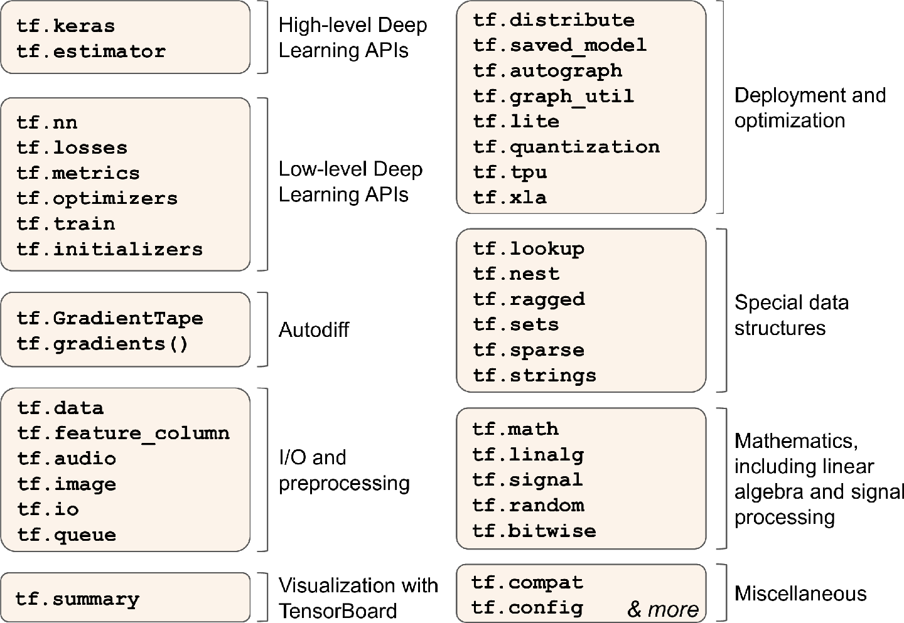
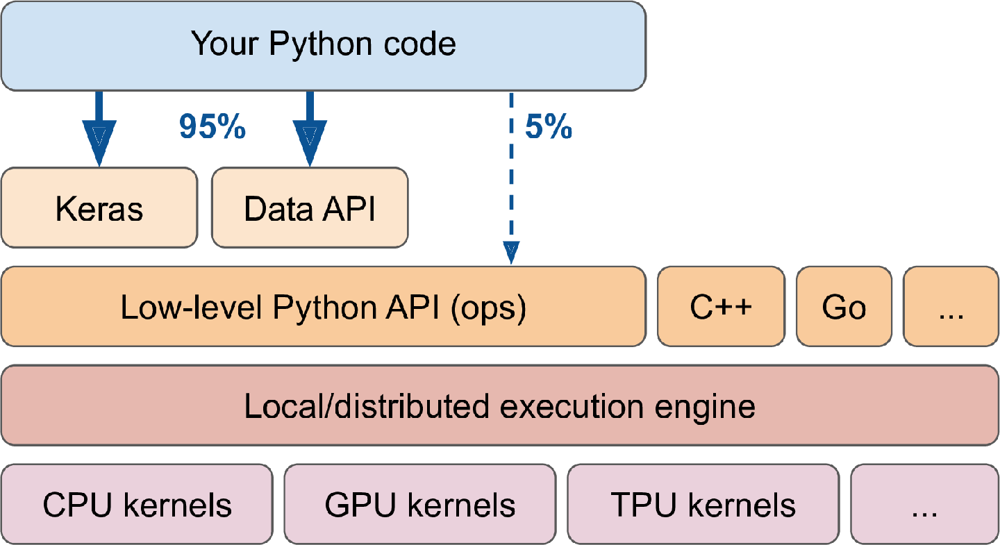

TensorFlow 是一个用于 numerical computation 的 powerful library，特别适合于大规模的（large-scale）机器学习（当然可以用来处理需要 heavy computation 的所有事）。

TensorFlow 提供了：

- 核心（core）与 NumPy 特别相似，但是支持 GPU
- 支持（跨多个 devices/servers）分布式计算（distributed computing）
- 包含一种 just-in-time (JIT) 编译器（compiler），可用于针对 speed 和 memory usage 来优化计算。工作方式：从 Python 函数中 extract 计算图（computation graph），然后优化计算图（如，剪去无用的 nodes），最后高效地运行（如，自动并行地运行独立的 ops）。
- 可以将计算图导出成一种可移植的格式（portable format），因此，可以在一个环境中训练 TF 模型，然后在另一个环境中运行。
- 支持 autodiff，并且提供一些 excellent 优化器（optimizer），因此，可以轻松地最小化各种损失函数。

TensorFlow 在这些 core features 基础上，提供更多的其他 features，最重要的是 `tf.keras`。当然，还有

- 数据加载和预处理 `tf.data`/`tf.io` 等
- 图片处理 `tf.iamge`
- 信号处理 op——`tf.signal`
- ...

 

下图是 TensorFlow 包含的 Python API：

在最底层（lowest level），每个 TensorFlow 操作（operation, op）都是用 C++ 写的。

很多 op 都有多种实现，称为 **kernel**。每一种 kernel 用于特定的设备类型——CPU、GPU 和 TPU（tensor processing units）。

- GPU：通过将计算切分成小块（smaller chunks），并在多 GPU threads 中并行计算，这可以大大地加快计算速度。
- TPU：更快，是专门为 DL ops 定制的 ASIC 芯片（ASIC chips）。

 

TensorFlow 的结构如下图所示。

TensorFlow 不仅仅只是一个 library。TensorFlow 是 extensive ecosystem of libraries 的 center。

- TensorBoard：用于可视化
- [TensorFlow Extended (TFX)](https://www.tensorflow.org/tfx)：是 Google 用来生产 TensorFlow 项目的一组 libraries。包含用于 data validation和预处理、模型分析和部署的工具。
- TensorFlow Hub：可以方便地下载和 reuse 预训练模型
- [TensorFlow model garden](https://github.com/tensorflow/models/)：可以获取很多神经网络结构，其中部分已经预训练了。
- 在 [TensorFlow Resources](https://www.tensorflow.org/resources) 和[这里](https://github.com/jtoy/awesome-tensorflow)可以找到很多 TensorFlow 项目。
- 越来越多的 ML 论文在发表的时候会公开代码，在[这里](https://paperswithcode.com/)可以找到。

